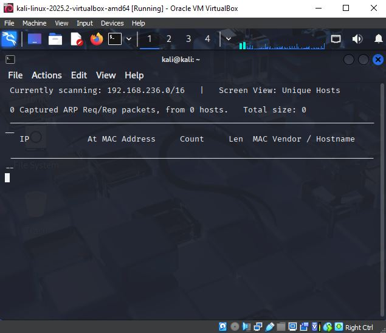
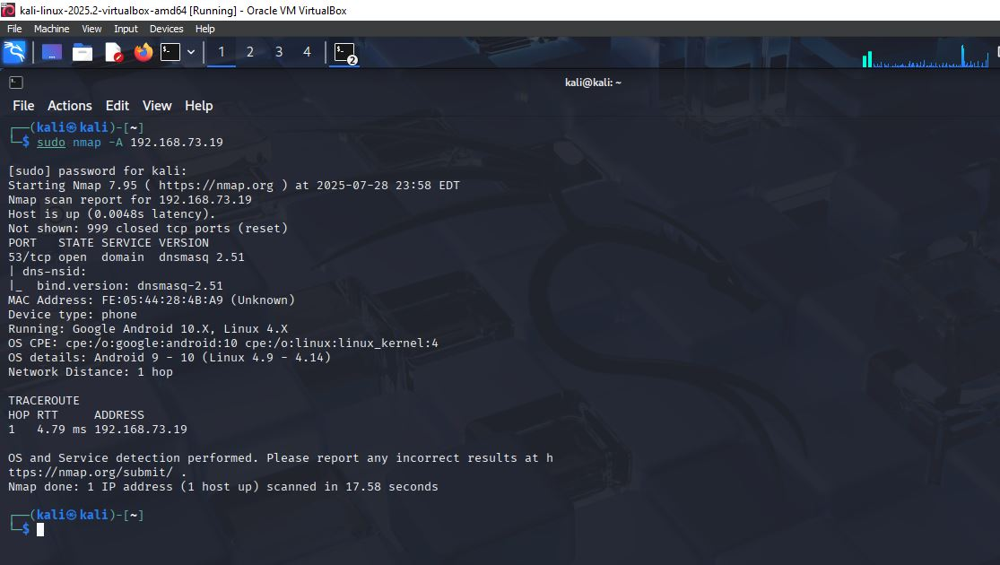
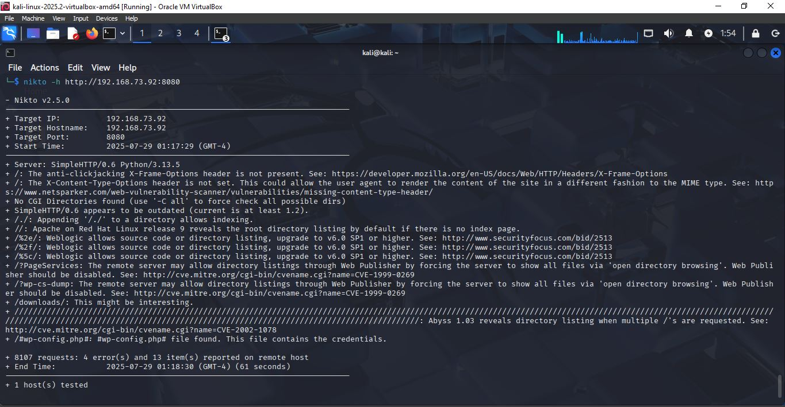

# 🔍 Network Scanning Project using Kali Linux (VirtualBox)

A beginner-friendly network scanning and vulnerability detection project built on Kali Linux. Perfect for students or entry-level professionals who want hands-on cybersecurity experience.

---

## 🧰 Tools Used

- 🐉 **Kali Linux** (VirtualBox environment)
- 🛰️ **Netdiscover** – Live host discovery
- 🌐 **Nmap** – Port scanning & OS detection
- 🔐 **Nikto** – Web vulnerability scanning

---

## 📁 Output Files

- 📄 `netdiscover.txt` – List of active hosts and MAC addresses  
- 📄 `nmap_scan.txt` – Open ports, services, OS info  
- 📄 `nikto_report.txt` – Web server vulnerability scan  

---

## 🖼️ Screenshots

### 🛰️ Netdiscover Output  


### 🌐 Nmap Scan Results  


### 🔐 Nikto Vulnerability Report  


---

## 🚀 Step-by-Step Procedure

### 1️⃣ Setup Environment
- Enabled **Bridged Adapter** in VirtualBox to connect via mobile hotspot

### 2️⃣ Discover Devices  
```bash
sudo netdiscover > netdiscover.txt
````

### 3️⃣ Scan with Nmap

```bash
sudo nmap -A 192.168.x.x > nmap_scan.txt
```

### 4️⃣ Web Vulnerability Scan with Nikto

```bash
nikto -h http://192.168.x.x > nikto_report.txt
```

---

## 📦 Project Folder Structure

```
network-scanning-kali/
├── netdiscover.txt
├── nmap_scan.txt
├── nikto_report.txt
├── README.md
└── screenshots/
    ├── netdiscover_screenshot.jpg
    ├── nmap_screenshot.jpg
    └── nikto_screenshot.jpg
```

---

## 👤 Author

**Inishi Dinethma**
📚 BSc (Hons) in Computer Networks Undergraduate
💡 Passionate about cybersecurity and network design
🔗 [LinkedIn Profile](http://linkedin.com/in/inishi-dinethma-852376264)

---

## 🔖 Keywords

`#KaliLinux` `#Cybersecurity` `#Nmap` `#Nikto` `#Netdiscover` `#VirtualBox` `#StudentProject` `#NetworkScanning`
